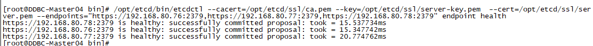

## 常用命令 ##

### 运行Jenkins
```
docker run -itd -p 8099:8080 -p 50009:50000 --name jenkins-master --privileged=true  mydemo/jenkins-master:v1.0
java -jar jenkins.war --ajp13Port=-1 --httpPort=8088
```

### 运行Nexus
```
docker run -d --name nexus3 --restart=always -p 8081:8081 -v C:\Workspace\myDemo\nexus:/nexus-data sonatype/nexus3
```

### 查看etcd集群健康状况

```
/opt/etcd/bin/etcdctl --cacert=/opt/etcd/ssl/ca.pem --key=/opt/etcd/ssl/server-key.pem  --cert=/opt/etcd/ssl/server.pem --endpoints="https://192.168.80.76:2379,https://192.168.80.77:2379,https://192.168.80.78:2379" endpoint health
```



### 拷贝

```
scp -r -P7122  /lib/systemd/system/etcd.service root@192.168.80.77:/lib/systemd/system/etcd.service
```

### 部署flanneld遇到的坑

```
bash etcd.sh etcd01 192.168.80.76 etcd02=https://192.168.80.77:2380,etcd03=https://192.168.80.78:2380

 /opt/etcd/bin/etcdctl --ca-file= /opt/etcd/bin/ca.pem --cert-file= /opt/etcd/bin/server.pem --key-file= /opt/etcd/bin/server-key.pem --endpoints="https://192.168.80.76:2379,https://192.168.80.77:2379,https://192.168.80.78:2379" cluster-health

bash apiserver.sh 192.168.80.76 https://192.168.80.76:2379,https://192.168.80.77:2379,https://192.168.80.78:2379


systemctl start kube-apiserver.service  ##开启服务
systemctl enable kube-apiserver.service
systemctl status kube-apiserver.service 
systemctl start kube-controller-manager.service 
systemctl enable kube-controller-manager.service
systemctl status kube-controller-manager.service
systemctl start kube-scheduler.service
systemctl enable kube-scheduler.service
systemctl status kube-scheduler.service


/opt/etcd/bin/etcdctl --ca-file=ca.pem --cert-file=server.pem --key-file=server-key.pem --endpoints="https://192.168.80.76:2379,https://192.168.80.77:2379,https://192.168.80.78:2379" set /coreos.com/network/config '{ "Network": "172.17.0.0/16", "Backend": {"Type": "vxlan"}}'

/opt/etcd/bin/etcdctl --cacert=/opt/etcd/ssl/ca.pem --key=/opt/etcd/ssl/server-key.pem  --cert=/opt/etcd/ssl/server.pem --endpoints="https://192.168.80.76:2379,https://192.168.80.77:2379,https://192.168.80.78:2379" get /coreos.com/network/config '{ "Network": "172.17.0.0/16", "Backend": {"Type": "vxlan"}}'

bash -x flannel.sh https://192.168.80.76:2379,https://192.168.80.77:2379,https://192.168.80.78:2379


--etcd-endpoints=https://192.168.80.76:2379,https://192.168.80.77:2379,https://192.168.80.78:2379
--etcd-cafile=/opt/etcd/ssl/ca.pem 
--etcd-certfile=/opt/etcd/ssl/server.pem 
--etcd-keyfile=/opt/etcd/ssl/server-key.pem 
--etcd-prefix=/coreos.com/network


/opt/etcd/bin/etcdctl --write-out=table --endpoints=http://192.168.80.76:2379,http://192.168.80.77:2379,http://192.168.80.78:2379 endpoint status
/opt/etcd/bin/etcdctl --endpoints=http://192.168.80.76:2379,http://192.168.80.77:2379,http://192.168.80.78:2379 member list
/opt/etcd/bin/etcdctl --cacert=/opt/etcd/ssl/ca.pem --key=/opt/etcd/ssl/server-key.pem  --cert=/opt/etcd/ssl/server.pem --endpoints="https://192.168.80.76:2379,https://192.168.80.77:2379,https://192.168.80.78:2379" endpoint health --write-out="table"
/opt/etcd/bin/etcdctl --cacert=/opt/etcd/ssl/ca.pem --key=/opt/etcd/ssl/server-key.pem  --cert=/opt/etcd/ssl/server.pem --endpoints="https://192.168.80.76:2379,https://192.168.80.77:2379,https://192.168.80.78:2379" member list --write-out="table"

/opt/etcd/bin/etcdctl --cacert=/opt/etcd/ssl/ca.pem --key=/opt/etcd/ssl/server-key.pem  --cert=/opt/etcd/ssl/server.pem --endpoints="https://192.168.80.76:2379,https://192.168.80.77:2379,https://192.168.80.78:2379" endpoint status --write-out="table"

/opt/etcd/bin/etcdctl --cacert=/opt/etcd/ssl/ca.pem --key=/opt/etcd/ssl/server-key.pem  --cert=/opt/etcd/ssl/server.pem --endpoints="https://192.168.80.76:2379,https://192.168.80.77:2379,https://192.168.80.78:2379" put /test/word 123456


ETCDCTL_API=2 /opt/etcd/bin/etcdctl --cacert=/opt/etcd/ssl/ca.pem --key=/opt/etcd/ssl/server-key.pem  --cert=/opt/etcd/ssl/server.pem --endpoints="https://192.168.80.76:2379,https://192.168.80.77:2379,https://192.168.80.78:2379" mk /coreos.com/network/config 

ETCDCTL_API=2 /opt/etcd/bin/etcdctl --cacert=/opt/etcd/ssl/ca.pem --key=/opt/etcd/ssl/server-key.pem  --cert=/opt/etcd/ssl/server.pem --endpoints="https://192.168.80.76:2379,https://192.168.80.77:2379,https://192.168.80.78:2379" set /coreos.com/network/config '{ "Network": "172.17.0.0/16", "Backend": {"Type": "vxlan"}}'


# 这个解决key not found
ETCDCTL_API=2 /opt/etcd/bin/etcdctl --ca-file=/opt/etcd/ssl/ca.pem --key-file=/opt/etcd/ssl/server-key.pem  --cert-file=/opt/etcd/ssl/server.pem --endpoints="https://192.168.80.76:2379,https://192.168.80.77:2379,https://192.168.80.78:2379" set /coreos.com/network/config '{ "Network": "172.17.0.0/16", "Backend": {"Type": "vxlan"}}'

```

## 复制到其他node

```
yum install -y yum-utils device-mapper-persistent-data lvm2 nano git
```

```
scp -P7122 root@192.168.80.76:/opt/docker/* /usr/bin/

cat > /usr/lib/systemd/system/docker.service <<EOF

[Unit]
Description=Docker Application Container Engine
Documentation=https://docs.docker.com
After=network-online.target firewalld.service
Wants=network-online.target

[Service]
Type=notify
ExecStart=/usr/bin/dockerd
ExecReload=/bin/kill -s HUP $MAINPID
LimitNOFILE=infinity
LimitNPROC=infinity
TimeoutStartSec=0
Delegate=yes
KillMode=process
Restart=on-failure
StartLimitBurst=3
StartLimitInterval=60s

[Install]
WantedBy=multi-user.target
EOF

systemctl start docker.service
systemctl enable docker.service

echo "net.ipv4.ip_forward=1" >> /etc/sysctl.conf 
sysctl -p

service network restart
systemctl restart docker
systemctl status docker

mkdir -p /opt/k8s
scp -P7122 root@192.168.80.76:/opt/k8s/flannel-v0.13.0-linux-amd64.tar.gz /opt/k8s
cd /opt/k8s
tar -zxvf flannel-v0.13.0-linux-amd64.tar.gz

mkdir /opt/kubernetes/{cfg,bin,ssl} -p
mv mk-docker-opts.sh flanneld /opt/kubernetes/bin/

scp -P7122 root@192.168.80.88:/opt/k8s/{flannel,kubelet,proxy}.sh /opt/k8s/
scp -P7122 -r root@192.168.80.76:/opt/etcd /opt/
bash -x flannel.sh https://192.168.80.76:2379,https://192.168.80.77:2379,https://192.168.80.78:2379
systemctl status flanneld

nano  /usr/lib/systemd/system/docker.service

[Unit]
Description=Docker Application Container Engine
Documentation=https://docs.docker.com
After=network-online.target firewalld.service
Wants=network-online.target

[Service]
Type=notify
EnvironmentFile=/run/flannel/subnet.env
ExecStart=/usr/bin/dockerd $DOCKER_NETWORK_OPTIONS
ExecReload=/bin/kill -s HUP
LimitNOFILE=infinity
LimitNPROC=infinity
TimeoutStartSec=0
Delegate=yes
KillMode=process
Restart=on-failure
StartLimitBurst=3
StartLimitInterval=60s

[Install]
WantedBy=multi-user.target

systemctl daemon-reload
systemctl restart docker
systemctl status docker

scp -P7122 -r root@192.168.80.88:/opt/kubernetes /opt/
scp -P7122 root@192.168.80.88:/usr/lib/systemd/system/{kubelet,kube-proxy}.service /usr/lib/systemd/system/
cd /opt/kubernetes/ssl/ 
rm -f /opt/kubernetes/ssl/*
cd /opt/kubernetes/cfg/
nano kubelet
--hostname-override=192.168.80.87 #修改ip
nano kubelet.config
address: 192.168.80.87 #修改ip
nano kube-proxy
--hostname-override=192.168.80.87 # 修改ip

systemctl start kubelet.service
systemctl enable kubelet.service  
systemctl start kube-proxy.service
systemctl enable kube-proxy.service

kubectl get csr # master执行
kubectl certificate approve node-csr-Z1pRzhZ5S3LhxN2cWWZoa-fci3Ro4Se5VWEBTExzLnE # 授权
kubectl get csr # master执行
kubectl get node # master执行

systemctl restart kubelet.service
systemctl restart kube-proxy.service


kubectl run nginx --image=harbor.rdev.tech/library/nginx:1.7.9
kubectl get pods


cat /opt/kubernetes/cfg/kubelet
sed -i "s/registry.cn-hangzhou.aliyuncs.com/192.168.80.54:8081/g"  /opt/kubernetes/cfg/kubelet
sed -i "s/pause-amd64:3.0/pause-amd64:3.1/g"  /opt/kubernetes/cfg/kubelet
cat /opt/kubernetes/cfg/kubelet


systemctl restart kubelet
systemctl restart kube-proxy

kubectl create clusterrolebinding system:anonymous --clusterrole=cluster-admin --user=system:anonymous

kubectl logs -n kube-system deploy/metrics-server
```

